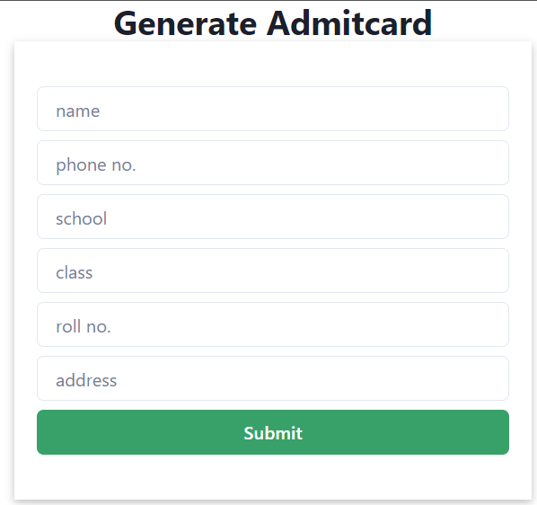
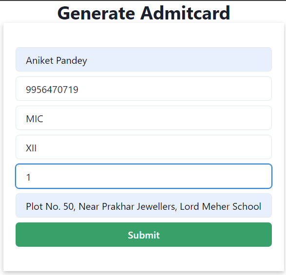
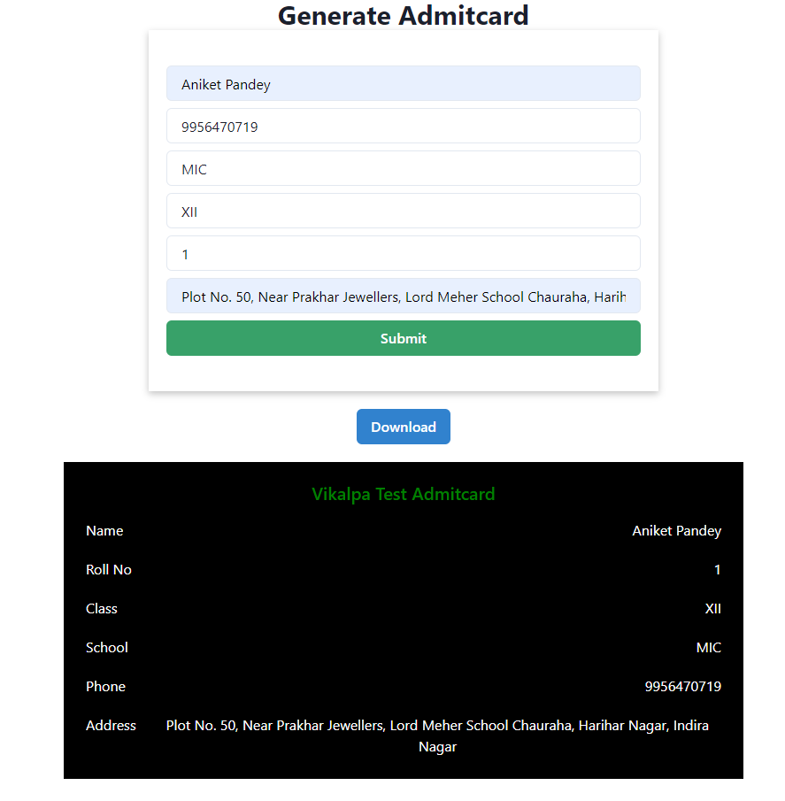

### How to go about project.

##### Clone the frontend repo

Paste `git clone https://github.com/aniketpandey2912/admitcard-frontend.git` in terminal.

##### Install packages

Go inside cloned project folder and paste `npm i` in terminal.

##### Run application in terminal.

Paste `npm start`

** Note : You also need to clone backend repository and run the backend server along with frontend to use application in action. So follow below instructions **

### Clone the backend repo

Paste `git clone https://github.com/aniketpandey2912/admitcard-backend-mysql.git` in terminal.

##### Install packages

Go inside cloned project folder and paste `npm i` in terminal.

### Run backend server.

Paste `npm run server`

### Run both Frontend and backend in parallel

** Enter valid details, you can follow below pictures **

#### For Code Base, checkout repos :

| Team members       | Github-profiles                                               |
| ------------------ | ------------------------------------------------------------- |
| Frontend Repo Link | <https://github.com/aniketpandey2912/admitcard-frontend>      |
| Backend Repo Link  | <https://github.com/aniketpandey2912/admitcard-backend-mysql> |
